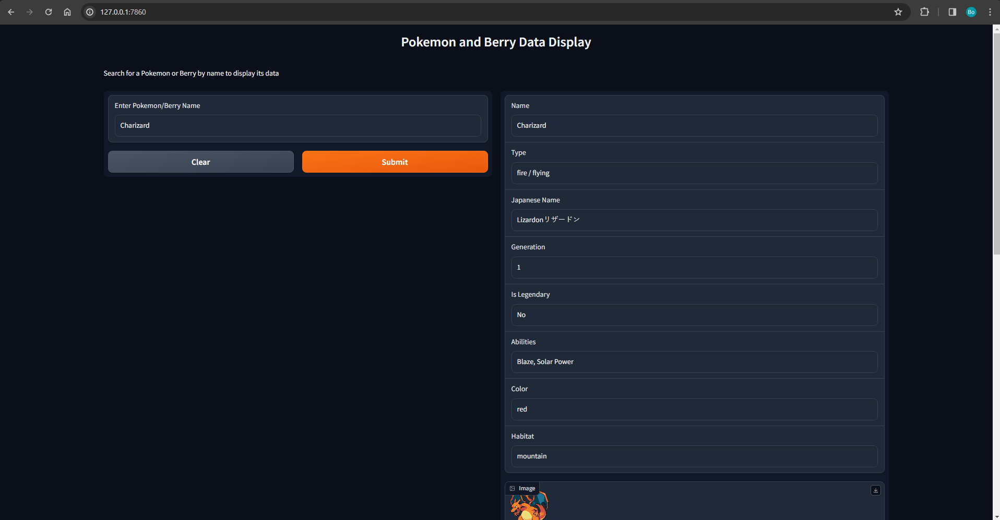

# Poke-API

Poke-API is a API built with the Laravel framework for accessing and managing Pokemon-related data. It's designed to provide a set of endpoints for querying Pokemon data, including statistics and abilities.

## Features

- API endpoints to fetch Pokemon data
- Detailed information on Pokémon abilities, stats, and types- Evolutionary chain lookups

## Requirements

- PHP >= 7.3
- Composer
- Laravel >= 8.x
- MySQL or any Laravel-supported database system

## Installation

1. Clone the repository:

git clone <git@git.nexed.com:bofolmer/poke-api.git>

2. Navigate to the project directory:

cd poke-api

3. Install dependencies.

composer install

4. Copy .env.example to .env and configure your environment variables, including database connections:

cp .env.example .env

5. Generate an application key:

php artisan key:generate

6. Run the database migrations (Set the database connection in .env before migrating):

php artisan migrate

7. Seed the database with initial data:

php artisan db:seed

8. Start the application:

php artisan serve

## Gradio

We've added Gradio to show the possibilities using the API.

This Gradio interface is a component of the Poke-API project, which provides a user-friendly way to search and display data about Pokémon and berries. It is built with the Gradio library to create a web application that allows users to enter a name and retrieve relevant information and images.

## Features

- Search functionality for Pokémon and berries by name.
- Displays various details about Pokémon, including type, Japanese name, generation, legendary status, abilities, color, habitat, classification, and egg group.
- Displays an image of the Pokémon if available.
- Presents detailed information about berries when searched.

## Requirements

- Python 3.6+
- Gradio
- Base64 for image handling

## Installation

1. Ensure that you have Python installed on your system.
2. Clone the repository or download the project files, including `api_display.py`, `data.json`, `berries.json`, and `stats.json`.
3. Install the required Python packages:

pip install gradio

## Running the Interface

1. Navigate to the directory containing the api_display.py script.

2. Run the script using Python:

python api_display.py

3. Once the script is running, it will print a local URL (usually http://127.0.0.1:7860/) you can open in your web browser to access the interface.

4. Enter a Pokémon or berry name into the text box and click submit to display the data.

